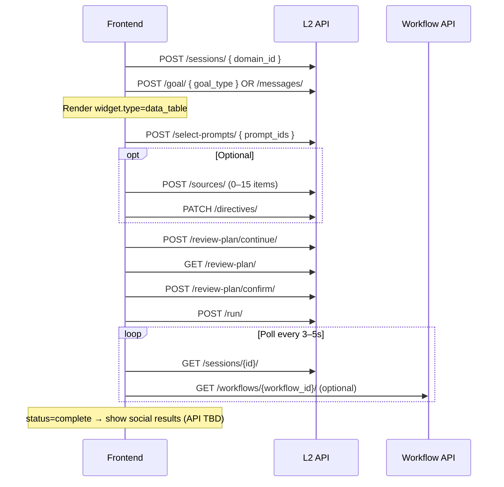

# Gravton L2 → Social Ingestion — Frontend Handover

**Branch:** `feat-opportunity`  
**Last updated:** 2026-06-13  
**Backend contact area:** `backend_src/apps/l2_opportunity/`, `backend_src/apps/intent_core/services/prompt_social.py`, `airflow/dags/l2_flow_opp_dag.py`

---

## 1. Executive summary

The L2 Opportunity flow is a **multi-step wizard** where a user:

1. Picks a **growth goal** (citation share, presence, etc.)
2. **Shortlists prompts** from a ranked table
3. Optionally adds **sources** and **brand directives**
4. **Confirms a review plan**
5. **Runs social ingestion** — backend triggers Reddit, Quora, and YouTube discovery DAGs

Social output is stored in **`PromptSocialArtifact`** (one DB row per discovered entity: thread, question, or video).

**Gap synthesis** (`synthesis`, `actionable_points`, `gap_signals`) is **not part of this phase**. That will run later in a separate `opportunity_dag` once social artifacts exist. **Do not build UI around synthesis blocks today.**

---

## 2. Architecture (three phases)

```
┌─────────────────────────────────────────────────────────────────┐
│  PHASE 1 — L2 Session (API / UI)          ← WIRE THIS NOW       │
│  Goal → shortlist prompts → sources → confirm plan → POST /run/ │
└────────────────────────────┬────────────────────────────────────┘
                             │
                             ▼
┌─────────────────────────────────────────────────────────────────┐
│  PHASE 2 — Social ingestion (Airflow, automatic after /run/)    │
│  l2_flow_opp → n-gram keywords → reddit / quora / youtube DAGs  │
│  Output → prompt_social_artifacts table                         │
└────────────────────────────┬────────────────────────────────────┘
                             │
                             ▼
┌─────────────────────────────────────────────────────────────────┐
│  PHASE 3 — Gap synthesis (future, NOT wired yet)              │
│  opportunity_dag: prompt + AI response + social artifacts       │
│  → synthesis / actionable_points / gap_signals                  │
└─────────────────────────────────────────────────────────────────┘
```

---

## 3. Base URL, auth, and conventions

| Item | Value |
|------|--------|
| API base | `/core/api/v1/l2-opportunity/` |
| Workflow API | `/core/api/v1/workflow/` |
| Auth header | `Authorization: Bearer <JWT>` |
| Content-Type | `application/json` |
| Org scoping | Resolved from logged-in user's `OrganizationUser` — no org header required |
| Domain | Passed as `domain_id` when creating a session |

### Error formats

**Field validation (400):**
```json
{
  "domain_id": ["Domain not found for your organization."],
  "prompt_ids": ["Ensure this field has at least 1 elements."]
}
```

**Simple errors (400 / 404 / 502):**
```json
{ "detail": "Human-readable message" }
```

---

## 4. Session state machine

### Steps (`current_step`)

| Step | Meaning | Frontend screen |
|------|---------|-----------------|
| `goal_select` | User must pick a goal | Goal picker / chat |
| `prompt_shortlist` | Goal set; show ranked prompts | Data table with multi-select |
| `sources_directives` | Prompts selected | Optional sources + directives form |
| `review_plan` | Ready to confirm | Review summary + confirm button |

### Status (`status`)

| Status | Meaning |
|--------|---------|
| `draft` | Session in progress, not ready to run |
| `ready` | Plan confirmed; can call `POST .../run/` |
| `running` | Social ingestion DAG triggered |
| `complete` | Parent `l2_flow_opp` workflow succeeded |
| `failed` | Parent workflow failed |

### Transitions

```
POST /sessions/                    → goal_select, draft
POST /goal/ or /messages/          → prompt_shortlist, draft
POST /select-prompts/              → sources_directives, draft
POST /review-plan/continue/       → review_plan, draft
POST /review-plan/confirm/         → review_plan, ready
POST /run/                         → review_plan, running
(Airflow callback on success)      → review_plan, complete
(Airflow callback on failure)      → review_plan, failed
```

### Key flags

| Field | When true |
|-------|-----------|
| `review_plan_confirmed` | User confirmed plan; sources are locked |
| `can_run_analysis` | Ready to trigger social ingestion (`ready` + confirmed + prompts selected) |

> **Naming note:** `can_run_analysis` and endpoint `/run/` retain legacy names. In the UI, label this **"Run social ingestion"**, not "Run analysis".

---

## 5. Widget-driven UI pattern

Most session responses include a `widget` object describing what to render. Prefer driving screens from `current_step` + `widget.type` rather than hard-coding step logic.

### Widget types

| `widget.type` | Step | Purpose |
|---------------|------|---------|
| `single_select` | `goal_select` | Goal metric picker |
| `data_table` | `prompt_shortlist` | Ranked prompt table with selection limits |
| `sources_form` | `sources_directives` | Optional URL/document/note + directives |
| `review_plan` | `review_plan` | Full plan summary before confirm |

### Example: goal select widget

```json
{
  "step": "goal_select",
  "type": "single_select",
  "message": "Which metric do you want to improve?",
  "options": [
    { "value": "citation_share", "label": "Citation share" },
    { "value": "presence", "label": "Presence" },
    { "value": "position", "label": "Position" },
    { "value": "sentiment", "label": "Sentiment" },
    { "value": "rank", "label": "Rank" }
  ]
}
```

### Example: prompt shortlist widget

```json
{
  "step": "prompt_shortlist",
  "type": "data_table",
  "message": "Here are the top prompts where you can improve. Select up to 10 to continue.",
  "min_selection": 1,
  "max_selection": 10,
  "items": [
    {
      "prompt_id": 565,
      "prompt_text": "Compare Pine Labs Touch vs Go POS terminals...",
      "cluster_id": 42,
      "topic_name": "POS Hardware and Specifications",
      "funnel": "Mid",
      "demand_label": "winning",
      "goal_type": "citation_share",
      "focal_value": 1.0,
      "peer_median": 0.33,
      "gap": 0.67,
      "prompt_volume": 1200,
      "rank_score": 0.85
    }
  ]
}
```

### Chat messages

`messages` is an append-only array:
```json
{ "role": "user" | "assistant", "content": "..." }
```

Use for conversational UI on the goal step; assistant messages guide the user through transitions.

---

## 6. Complete API reference

### 6.1 Create session

```
POST /core/api/v1/l2-opportunity/sessions/
```

**Request:**
```json
{ "domain_id": 16 }
```

**Response `201`:**
```json
{
  "session_id": 1,
  "domain_id": 16,
  "goal_type": null,
  "current_step": "goal_select",
  "status": "draft",
  "messages": [
    { "role": "assistant", "content": "Tell me what you want to improve, or pick a metric below." }
  ],
  "selected_prompt_ids": [],
  "workflow_id": null,
  "brand_directives": { "tone": "", "positioning": "", "exclusions": "" },
  "sources": [],
  "review_plan_confirmed": false,
  "can_run_analysis": false,
  "widget": { "...goal_select widget..." }
}
```

---

### 6.2 Get session (primary poll endpoint)

```
GET /core/api/v1/l2-opportunity/sessions/{session_id}/
```

**Response `200`:** Full `session_snapshot` (see §7).

Poll this after `POST /run/` until `status` is `complete` or `failed`.

---

### 6.3 Send chat message (optional NLP goal)

```
POST /core/api/v1/l2-opportunity/sessions/{session_id}/messages/
```

**Request:**
```json
{ "text": "I want to improve citation share" }
```

**Response `200`:** `session_snapshot`

- Recognized goal → advances to `prompt_shortlist`, widget contains ranked items
- Unrecognized → stays on `goal_select`, returns goal picker widget again

---

### 6.4 Set goal explicitly

```
POST /core/api/v1/l2-opportunity/sessions/{session_id}/goal/
```

**Request:**
```json
{ "goal_type": "citation_share" }
```

**Allowed values:** `citation_share` | `presence` | `position` | `sentiment` | `rank`

**Response `200`:** `session_snapshot` with `current_step: "prompt_shortlist"`

---

### 6.5 Get ranked candidates (standalone)

```
GET /core/api/v1/l2-opportunity/sessions/{session_id}/candidates/
```

**Response `200`:**
```json
{
  "items": [ "...same rows as shortlist widget..." ],
  "total": 45,
  "demand_universe_run_id": 12,
  "eligible_count": 45,
  "candidate_prompt_ids": [565, 569, 570]
}
```

**Error `400`:**
```json
{ "detail": "Set a goal before requesting candidates." }
```

---

### 6.6 Select prompts

```
POST /core/api/v1/l2-opportunity/sessions/{session_id}/select-prompts/
```

**Request:**
```json
{ "prompt_ids": [565, 569, 570] }
```

**Constraints:** 1–10 prompts; each must be in the current shortlist (`candidate_prompt_ids`).

**Response `200`:** `session_snapshot` with `current_step: "sources_directives"`

**Error `400`:**
```json
{ "detail": "prompt_id=999 is not in the current shortlist." }
```

---

### 6.7 List sources

```
GET /core/api/v1/l2-opportunity/sessions/{session_id}/sources/
```

**Response `200`:**
```json
{
  "items": [
    {
      "id": 1,
      "source_type": "url",
      "url": "https://brand.com/about",
      "document_ref": "",
      "notes": "",
      "title": "About page",
      "created_at": "2026-06-12T09:00:00+00:00"
    }
  ]
}
```

---

### 6.8 Add source

```
POST /core/api/v1/l2-opportunity/sessions/{session_id}/sources/
```

**URL source:**
```json
{
  "source_type": "url",
  "url": "https://brand.com/about",
  "title": "About page",
  "notes": "Optional context"
}
```

**Document source:**
```json
{
  "source_type": "document",
  "document_ref": "s3://bucket/file.pdf",
  "title": "Product spec"
}
```

**Note source:**
```json
{
  "source_type": "note",
  "notes": "We never mention competitor X by name."
}
```

**Response `201`:** Single source object.

**Validation rules:**
- Max 15 sources per session
- URL must be `http`/`https`
- `document` requires `document_ref`
- `note` requires `notes`
- Duplicate URLs rejected
- Locked after review plan confirmed

---

### 6.9 Delete source

```
DELETE /core/api/v1/l2-opportunity/sessions/{session_id}/sources/{source_id}/
```

**Response `204`:** Empty body.

---

### 6.10 Update brand directives

```
PATCH /core/api/v1/l2-opportunity/sessions/{session_id}/directives/
```

**Request (all optional):**
```json
{
  "tone": "Professional, confident",
  "positioning": "Enterprise POS leader in India",
  "exclusions": "Do not recommend Paytm for enterprise"
}
```

**Response `200`:** Full `review_plan` object (§7.2).

---

### 6.11 Get review plan

```
GET /core/api/v1/l2-opportunity/sessions/{session_id}/review-plan/
```

**Response `200`:** `review_plan` object (§7.2).

---

### 6.12 Advance to review plan step

```
POST /core/api/v1/l2-opportunity/sessions/{session_id}/review-plan/continue/
```

**Request:** `{}` (empty body)

**Response `200`:** `session_snapshot` with `current_step: "review_plan"`

---

### 6.13 Confirm review plan

```
POST /core/api/v1/l2-opportunity/sessions/{session_id}/review-plan/confirm/
```

**Request:** `{}` (empty body)

**Response `200`:** `session_snapshot` with:
- `review_plan_confirmed: true`
- `status: "ready"`
- `can_run_analysis: true`
- Assistant message: *"Plan confirmed. You can now run social ingestion for the selected prompts."*

---

### 6.14 Run social ingestion ⭐

```
POST /core/api/v1/l2-opportunity/sessions/{session_id}/run/
```

**Request:** `{}` (empty body)

**Preconditions:**
- `review_plan_confirmed === true`
- `status === "ready"`
- At least one prompt selected

**Response `202 Accepted`:**
```json
{
  "...session_snapshot fields...",
  "status": "running",
  "workflow_id": 42,
  "dag_run_id": "manual__2026-06-12T10:00:00+00:00"
}
```

**What happens backend-side (no extra frontend calls):**
1. Creates a `Workflow` record (`dag_id: "l2_flow_opp"`)
2. Airflow validates session and extracts n-gram keywords from each prompt's text
3. Triggers child workflows: `reddit_dag`, `quora_dag`, `youtube_dag`
4. Each DAG writes `PromptSocialArtifact` rows

**Errors:**
```json
{ "detail": "Confirm the review plan before running social ingestion." }   // 400
{ "detail": "Session is not ready to run social ingestion." }              // 400
{ "detail": "No prompts selected." }                                       // 400
{ "detail": "Failed to trigger social ingestion: ..." }                    // 502
```

---

### 6.15 Get synthesis (reserved — do not use in L2 UI yet)

```
GET /core/api/v1/l2-opportunity/sessions/{session_id}/synthesis/
```

Returns synthesis payload per selected prompt. **Currently empty/pending** after social ingestion. Wire only when Phase 3 (`opportunity_dag`) is implemented.

Also included in `session_snapshot.synthesis` when `status` is `running`, `complete`, or `failed`.

---

### 6.16 Poll workflow status

```
GET /core/api/v1/workflow/workflows/{workflow_id}/
```

**Response `200`:**
```json
{
  "id": 42,
  "organization": 8,
  "domain": 16,
  "dag_id": "l2_flow_opp",
  "run_status": "success",
  "run_status_message": "DAG triggered with run ID: manual__...",
  "url": "http://airflow:8080/dags/l2_flow_opp/grid?dag_run_id=...",
  "run_completed_at": "2026-06-12T10:05:00+00:00"
}
```

**`run_status` values:** `queued` | `running` | `success` | `failed`

When parent `l2_flow_opp` completes, Airflow callback updates session `status` to `complete` or `failed`. **Prefer polling `GET /sessions/{id}/`** for user-facing status.

---

## 7. Shared response shapes

### 7.1 `session_snapshot`

Returned by most session endpoints. Core fields:

```json
{
  "session_id": 1,
  "domain_id": 16,
  "goal_type": "citation_share",
  "current_step": "review_plan",
  "status": "ready",
  "messages": [],
  "selected_prompt_ids": [565, 569, 570],
  "workflow_id": null,
  "brand_directives": { "tone": "", "positioning": "", "exclusions": "" },
  "sources": [],
  "review_plan_confirmed": true,
  "can_run_analysis": true,
  "widget": { "...step-specific..." },
  "review_plan": { "...only on sources_directives / review_plan steps..." },
  "synthesis": { "...only when status is running|complete|failed..." }
}
```

### 7.2 `review_plan`

```json
{
  "session_id": 1,
  "domain_id": 16,
  "goal_type": "citation_share",
  "goal_label": "Citation share",
  "selected_prompts": [
    {
      "prompt_id": 565,
      "prompt_text": "Compare Pine Labs Touch vs Go POS terminals...",
      "rank_score": 0.85,
      "gap_snapshot": {
        "goal_type": "citation_share",
        "focal_value": 1.0,
        "peer_median": 0.33,
        "gap": 0.67,
        "prompt_volume": 1200
      }
    }
  ],
  "sources": [],
  "brand_directives": { "tone": "", "positioning": "", "exclusions": "" },
  "review_plan_confirmed": false,
  "can_run_analysis": false
}
```

### 7.3 `synthesis` (future — ignore for now)

```json
{
  "session_id": 1,
  "domain_id": 16,
  "goal_type": "citation_share",
  "status": "complete",
  "synthesis_summary": {
    "total": 3,
    "complete": 0,
    "failed": 0,
    "pending": 3,
    "running": 0
  },
  "items": [
    {
      "selection_id": 10,
      "prompt_id": 565,
      "synthesis_status": "pending",
      "synthesis_error": "",
      "synthesized_at": null,
      "llm_model_id": "",
      "synthesis": {},
      "actionable_points": [],
      "gap_signals": {},
      "confidence": null,
      "goal_type": null
    }
  ]
}
```

---

## 8. Recommended frontend flow (sequence)



---

## 9. Social artifacts — data model (no REST API yet)

### ⚠️ Gap: no public endpoint

There is **no REST API** for reading `PromptSocialArtifact` yet. Backend service `prompt_social_detail(prompt_id)` exists but is not exposed.

**Proposed endpoints (backend to implement):**
```
GET /core/api/v1/l2-opportunity/sessions/{session_id}/social-artifacts/
GET /core/api/v1/intent/prompts/{prompt_id}/social-artifacts/
```

Until then, social results are visible in Django admin: **Intent core → Prompt social artifacts**.

### Artifact shape (for UI planning)

One row per discovered entity (thread / question / video):

```json
{
  "id": 101,
  "domain_id": 16,
  "prompt_id": 565,
  "keyword": "compare pine labs touch",
  "platform": "reddit",
  "artifact_type": "thread",
  "title": "Touch vs Go for retail stores",
  "url": "https://www.reddit.com/r/.../comments/...",
  "external_id": "t3_abc123",
  "ingestion_batch_id": 3,
  "metadata": {
    "subreddit": "POS",
    "score": 42,
    "mention_brands": ["Pine Labs", "Innoviti"],
    "sentiment_bucket": "neutral",
    "funnel_stage": "consideration",
    "persona": "practitioner",
    "chunks": [],
    "answers": []
  },
  "created_at": "2026-06-12T10:10:00+00:00"
}
```

**Platforms:** `reddit` | `quora` | `youtube`  
**Artifact types:** `thread` | `question` | `video`  
**Grouping suggestion:** Group by `prompt_id` → `platform` → list of artifacts.

### How keywords are derived (for UI copy / loading states)

Keywords come from **n-gram extraction of `SyntheticPrompt.text` only** — not from synthesis or gap signals.

- Up to **5 keywords per prompt**
- Scores: 1.0, 0.92, 0.84, 0.76, 0.68 (decreasing importance)
- Example for prompt 565: full text → 4-word n-grams → 3-word n-grams → etc.

Show a loading state like: *"Discovering Reddit, Quora, and YouTube content for 3 prompts (15 keywords)..."*

---

## 10. What NOT to build in this sprint

| Feature | Reason |
|---------|--------|
| Synthesis / actionable points / gap signals UI | Deferred to `opportunity_dag` (Phase 3) |
| `GET /synthesis/` results display | Returns pending/empty until Phase 3 |
| Per-platform workflow polling | Child reddit/quora/youtube workflows are internal; poll parent session only |
| Re-running social ingestion from UI | Not supported; would need new backend endpoint |
| Editing sources after plan confirm | Backend rejects with 400 |

---

## 11. UI screen checklist

| # | Screen | API calls | Done when |
|---|--------|-----------|-----------|
| 1 | Goal selection | `POST /sessions/`, `POST /goal/` or `/messages/` | `current_step !== goal_select` |
| 2 | Prompt shortlist | Use `widget.items` or `GET /candidates/` | `POST /select-prompts/` succeeds |
| 3 | Sources & directives | `GET/POST/DELETE /sources/`, `PATCH /directives/` | User clicks continue |
| 4 | Review plan | `POST /review-plan/continue/`, `GET /review-plan/` | User confirms |
| 5 | Confirm & run | `POST /review-plan/confirm/`, `POST /run/` | `status === running` |
| 6 | In progress | Poll `GET /sessions/{id}/` | `status === complete \| failed` |
| 7 | Social results | **Blocked** — needs new API | Artifacts available per prompt |

---

## 12. Polling strategy

After `POST /run/`:

```typescript
// Pseudocode
async function pollSession(sessionId: number) {
  const interval = 4000; // 4 seconds
  const maxAttempts = 90; // ~6 minutes

  for (let i = 0; i < maxAttempts; i++) {
    const session = await GET(`/l2-opportunity/sessions/${sessionId}/`);

    if (session.status === 'complete') return { ok: true, session };
    if (session.status === 'failed') return { ok: false, session };

    await sleep(interval);
  }
  return { ok: false, timeout: true };
}
```

Optional: also poll `GET /workflow/workflows/{workflow_id}/` for Airflow grid link (`url` field) — useful for a "View in Airflow" debug link, not for user-facing status.

---

## 13. Test data (domain 16 — Pine Labs)

| Item | Value |
|------|--------|
| Domain ID | 16 |
| Org ID | 8 |
| Sample prompts | 565, 569, 570 |
| Topic | POS Hardware and Specifications |
| Goal used in samples | `citation_share` |
| Admin | `http://localhost:8000/core/admin/brandkit/domain/16/change/` |
| Sample dump | `backend_src/samples/domain_16_l2_to_social_sample.txt` |

Example prompt texts:
- **565:** Compare Pine Labs Touch vs Go POS terminals for retail stores...
- **569:** What is the total cost of ownership and implementation timeline...
- **570:** Which Pine Labs POS hardware model offers the best battery life...

---

## 14. Local dev setup

```bash
# From gravton-console repo root
docker compose -f docker-compose-local.yml up -d --build

# Run migrations (if needed)
docker exec gravton-server python manage.py migrate

# Regenerate sample dump
docker exec gravton-server python /app/scripts/dump_domain_16_l2_social_sample.py
```

**Required env vars for social DAGs** (in `.env`):
- `SERPAPI_API_KEY` — Reddit SERP discovery
- `APIFY_API_TOKEN` — Quora scraping
- `QUORA_DISCOVERY_ACTOR_ID=crawlerbros~quora-search-scraper`

---

## 15. Backend dependencies for frontend

| Dependency | Status | Impact on FE |
|------------|--------|--------------|
| L2 session APIs | ✅ Ready | Full wizard can be built |
| `POST /run/` social trigger | ✅ Ready | Run button works |
| Session status polling | ✅ Ready | Progress screen works |
| Social artifacts REST API | ❌ Missing | Results screen blocked |
| Gap synthesis API | ❌ Future | Do not implement |
| WebSocket / SSE for run progress | ❌ Not implemented | Use polling |

**Action needed from backend:** Expose `GET .../social-artifacts/` before frontend can show Reddit/Quora/YouTube results.

---

## 16. TypeScript types (starter)

```typescript
type GoalType = 'citation_share' | 'presence' | 'position' | 'sentiment' | 'rank';
type SessionStep = 'goal_select' | 'prompt_shortlist' | 'prompt_select' | 'sources_directives' | 'review_plan';
type SessionStatus = 'draft' | 'ready' | 'running' | 'complete' | 'failed';
type SourceType = 'url' | 'document' | 'note';
type SocialPlatform = 'reddit' | 'quora' | 'youtube';
type ArtifactType = 'thread' | 'question' | 'video';

interface ChatMessage {
  role: 'user' | 'assistant';
  content: string;
}

interface BrandDirectives {
  tone: string;
  positioning: string;
  exclusions: string;
}

interface UserSource {
  id: number;
  source_type: SourceType;
  url: string;
  document_ref: string;
  notes: string;
  title: string;
  created_at: string | null;
}

interface CandidatePrompt {
  prompt_id: number;
  prompt_text: string;
  cluster_id: number;
  topic_name: string;
  funnel: string;
  demand_label: string;
  goal_type: GoalType;
  focal_value: number | null;
  peer_median: number | null;
  gap: number | null;
  prompt_volume: number | null;
  rank_score: number;
}

interface SelectedPrompt {
  prompt_id: number;
  prompt_text: string;
  rank_score: number;
  gap_snapshot: Record<string, unknown>;
}

interface ReviewPlan {
  session_id: number;
  domain_id: number;
  goal_type: GoalType | null;
  goal_label: string;
  selected_prompts: SelectedPrompt[];
  sources: UserSource[];
  brand_directives: BrandDirectives;
  review_plan_confirmed: boolean;
  can_run_analysis: boolean;
}

interface SessionSnapshot {
  session_id: number;
  domain_id: number;
  goal_type: GoalType | null;
  current_step: SessionStep;
  status: SessionStatus;
  messages: ChatMessage[];
  selected_prompt_ids: number[];
  workflow_id: number | null;
  brand_directives: BrandDirectives;
  sources: UserSource[];
  review_plan_confirmed: boolean;
  can_run_analysis: boolean;
  widget: Record<string, unknown> | null;
  review_plan?: ReviewPlan;
  synthesis?: Record<string, unknown>; // ignore for now
}

interface RunResponse extends SessionSnapshot {
  dag_run_id?: string;
}

// Future — when backend exposes social artifacts API
interface PromptSocialArtifact {
  id: number;
  domain_id: number;
  prompt_id: number;
  keyword: string;
  platform: SocialPlatform;
  artifact_type: ArtifactType;
  title: string;
  url: string;
  external_id: string;
  ingestion_batch_id: number;
  metadata: Record<string, unknown>;
  created_at: string;
}
```

---

## 17. Open questions for backend

1. **Social artifacts API** — Confirm endpoint shape and whether to group by prompt/platform in the response.
2. **Re-run behavior** — Can users run social ingestion again on the same session, or must they create a new session?
3. **Partial failure** — If Quora succeeds but YouTube fails, does session still go to `complete`? (Currently parent `l2_flow_opp` succeeds if at least one platform triggers.)
4. **Child DAG visibility** — Should frontend show per-platform progress (reddit/quora/youtube)? Would need new backend aggregation endpoint.
5. **Rename `can_run_analysis`** — Consider renaming to `can_run_social_ingestion` in a future API version.

---

## 18. Reference files (backend)

| Path | Purpose |
|------|---------|
| `backend_src/apps/l2_opportunity/views.py` | All L2 API views |
| `backend_src/apps/l2_opportunity/urls.py` | Route definitions |
| `backend_src/apps/l2_opportunity/services/session_state.py` | Snapshot + widgets |
| `backend_src/apps/l2_opportunity/services/review_plan.py` | Review plan builder |
| `backend_src/apps/l2_opportunity/constants.py` | Enums and limits |
| `backend_src/apps/intent_core/services/prompt_social.py` | Keyword extraction + artifact helpers |
| `backend_src/apps/intent_core/models.py` | `PromptSocialArtifact` model |
| `airflow/dags/l2_flow_opp_dag.py` | Social ingestion orchestration |
| `backend_src/samples/domain_16_l2_to_social_sample.txt` | End-to-end sample conf + output shapes |

---

*Document generated for frontend handoff. For questions, refer to the `feat-opportunity` branch or the sample dump at `backend_src/samples/domain_16_l2_to_social_sample.txt`.*
